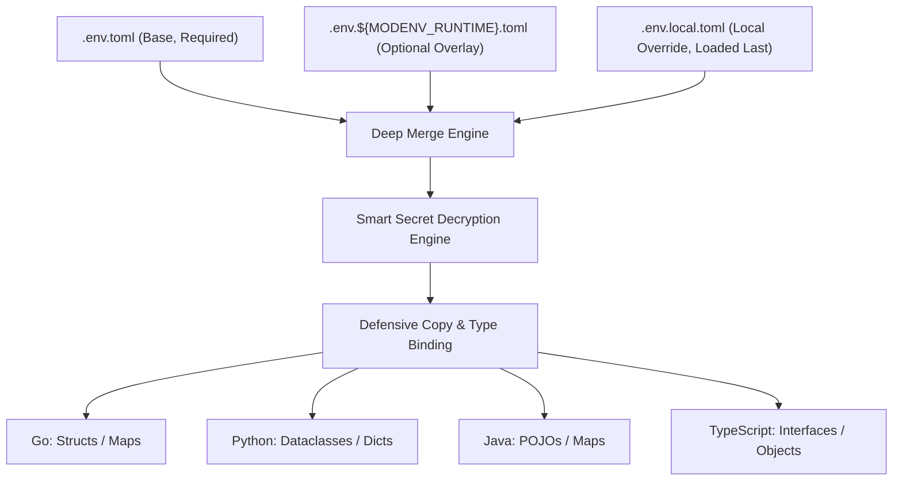

# modenv

Hierarchical TOML configuration, secret decryption, and environment management for Go, Python, Java, and TypeScript.

[](https://retail-cortex.github.io/modenv/)
[](LICENSE)

`modenv` simplifies enterprise application configuration by merging cascading configuration layers, dynamically resolving runtime environment overrides, and automatically decrypting stored secrets on the fly.

> **Full Documentation & Integration Guides:** [https://retail-cortex.github.io/modenv/](https://retail-cortex.github.io/modenv/)

## Authors
- **Ryan McGuinness** (Lead Engineer)
- **Hanna** (AI Pair Programmer)

---

## Architectural Tenets



1. **Hierarchical Cascading Configuration**: Base configuration (`.env.toml`) is required; runtime environment overlays (`.env.${MODENV_RUNTIME}.toml`) and local uncommitted overlays (`.env.local.toml`) take deterministic precedence.
2. **Prefix Path Routing**: Resolves and reads/writes all configuration files relative to `MODENV_PREFIX` (defaults to current working directory).
3. **Deep Merging**: Recursively merges nested key-value pairs across overlays without clobbering unmentioned siblings.
4. **Transparent Smart Secret Decryption**: Values starting with URI schemes are decrypted or resolved on load:
   - `simple://` and legacy `xor:`: Symmetric XOR encryption using `MODENV_KEY`.
   - `pks://`: Enterprise RSA PKCS#1 v1.5 asymmetric encryption (resolved via `MODENV_PRIVATE_KEY`, `MODENV_KEY_LOCATION`, or `[secrets_store]`).
   - `cloud://`: Direct Google Cloud Secret Manager resolution with OAuth2 credentials and `MODENV_CLOUD_SECRET_<NAME>` test overrides.
5. **Defensive Copying**: Always returns isolated deep clones to prevent runtime mutation leaks.
6. **Environment Lifecycle Management**: `EnvManager` records original variable states upon mutation and guarantees clean rollbacks via `restore()`.
7. **Unified CLI**: Standardized command-line utility in Go (`//cmd/cli`) built as a single universal binary for all platforms (`setup`, `read`, `encode`).

---

## Language Ecosystems & Matrix

| Component | Directory | Bazel Target | CLI / Test Target |
| :--- | :--- | :--- | :--- |
| **Universal CLI** | [`cmd/cli/`](cmd/cli/) | `//cmd/cli` | `//cmd/cli:cli_test` |
| **Go Client** | [`clients/go/`](clients/go/) | `//clients/go/pkg/modenv` | `//clients/go/...` |
| **Python Client** | [`clients/python/`](clients/python/) | `//clients/python:modenv` | `//clients/python/...` |
| **Java Client** | [`clients/java/`](clients/java/) | `//clients/java:modenv` | `//clients/java/...` |
| **TypeScript Client** | [`clients/typescript/`](clients/typescript/) | `//clients/typescript:modenv_sources` | `//clients/typescript:modenv_test` |
| **Test Configs** | [`test/configs/`](test/configs/) | `//test:test_configs` | - |
| **Docs** | [`docs/`](docs/) | `//docs:site` | `//docs:serve` / `//docs:site_test` |

---

## Quickstart Examples

### Go
```go
package main

import (
	"fmt"
	"github.com/rrmcguinness/modenv/pkg/modenv"
)

type Config struct {
	AppName  string `toml:"app_name"`
	Port     int    `toml:"port"`
	Database struct {
		Password string `toml:"password"` // Decrypted transparently (simple://, pks://, cloud://, or legacy xor:)
	} `toml:"database"`
}

func main() {
	var cfg Config
	clone, _ := modenv.Load(&cfg)
	appConfig := clone.(*Config)
	fmt.Printf("Started %s on port %d\n", appConfig.AppName, appConfig.Port)
}
```

### Python
```python
from dataclasses import dataclass
from modenv import load

@dataclass
class DatabaseConfig:
    host: str = "localhost"
    password: str = ""  # Decrypted transparently (simple://, pks://, cloud://, or legacy xor:)

@dataclass
class AppConfig:
    app_name: str = ""
    port: int = 8080
    database: DatabaseConfig = DatabaseConfig()

config = load(AppConfig())
print(f"Started {config.app_name} on port {config.port}")
```

### Java
```java
import com.retailcortex.modenv.Modenv;

public class Main {
    public static class AppConfig {
        public String appName;
        public int port;
        public DatabaseConfig database = new DatabaseConfig();
    }
    public static class DatabaseConfig {
        public String password; // Decrypted transparently (simple://, pks://, cloud://, or legacy xor:)
    }

    public static void main(String[] args) throws Exception {
        AppConfig config = Modenv.load(new AppConfig());
        System.out.printf("Started %s on port %d%n", config.appName, config.port);
    }
}
```

### TypeScript
```typescript
import { load } from "@retail-cortex/modenv";

interface AppConfig {
  app_name: string;
  port: number;
  database: { password: string }; // Decrypted transparently (simple://, pks://, cloud://, or legacy xor:)
}

const config = load<AppConfig>();
console.log(`Started ${config.app_name} on port ${config.port}`);
```

---

## Building and Testing with Bazel

All languages and documentation are orchestrated through Bazel:

```bash
# Run all test suites across Go, Python, Java, TypeScript, and Hugo docs
bazel test //...

# Build all binaries and libraries
bazel build //...

# Run the universal CLI (Go)
bazel run //cmd/cli -- encode "my_db_password"

# Build static documentation site
bazel build //docs:site

# Launch local interactive documentation server (Hugo)
bazel run //docs:serve
```

---

## Documentation Site

Comprehensive documentation, architectural specifications, and integration walkthroughs are published at:

🔗 **[https://retail-cortex.github.io/modenv/](https://retail-cortex.github.io/modenv/)**

- [Tenets of Configuration](https://retail-cortex.github.io/modenv/docs/)
- [Smart Secrets & Secret Stores](https://retail-cortex.github.io/modenv/docs/secrets/)
- [Universal CLI](https://retail-cortex.github.io/modenv/docs/cli/)
- [Go Integration](https://retail-cortex.github.io/modenv/docs/go/integration/)
- [Python Integration](https://retail-cortex.github.io/modenv/docs/python/integration/)
- [Java Integration](https://retail-cortex.github.io/modenv/docs/java/integration/)
- [TypeScript Integration](https://retail-cortex.github.io/modenv/docs/typescript/integration/)
- [Upgrading & Migration](https://retail-cortex.github.io/modenv/docs/upgrading/)

To run the documentation site locally:
```bash
bazel run //docs:serve
```
Then navigate to `http://localhost:1313`.

---

## Upgrading from the Previous Version

This release introduces polyglot client packages, centralized test configurations, smart multi-tiered secrets, and a unified Go CLI. Review the migration guidelines below:

### 1. Secret Schemes & Smart Secrets
- **Backward Compatibility for `xor:`**: Existing encrypted secrets starting with `xor:<hex>` continue to decrypt transparently with zero breaking changes.
- **Migration to `simple://`**: The standard symmetric XOR scheme now uses the `simple://` URI prefix. To migrate legacy values:
  ```bash
  # Generate modern simple:// secret
  bazel run //cmd/cli -- encode "my-secret-value"
  # Legacy prefix is still available if needed
  bazel run //cmd/cli -- encode --legacy "my-secret-value"
  ```
- **New Asymmetric RSA (`pks://`) & Cloud (`cloud://`) Schemes**:
  - Encrypt secrets using RSA public keys via `pks://` for asymmetric decryption at runtime.
  - Reference Google Cloud Secret Manager secrets directly via `cloud://<secret-name>` or `cloud://projects/<p>/secrets/<s>/versions/<v>`.
- **Optional `[secrets_store]` Table**: Declare baseline secret store settings at the root of `.env.toml`:
  ```toml
  [secrets_store]
  type = "simple"
  google_cloud_project = "my-gcp-project"
  key_location = "keys/private.pem"
  ```

### 2. Workspace Layout & Monorepo Structure
- **Go Client Relocation**: Go client code has moved from `pkg/modenv/` to `clients/go/pkg/modenv/`.
  - **Bazel dependencies**: Update Bazel targets from `@modenv//pkg/modenv` to `@modenv//clients/go/pkg/modenv`.
  - **Go modules**: The module import path remains `github.com/rrmcguinness/modenv/pkg/modenv`.
- **Polyglot Ecosystem**: Native clients are now available for [Python](clients/python/), [Java](clients/java/), and [TypeScript](clients/typescript/).
- **Universal CLI Target**: The CLI binary target has transitioned from `//cmd/modenv` to `//cmd/cli` (or root alias `//:modenv`).
- **Centralized Test Configs**: Test fixtures previously in `test/` now live under `test/configs/` (`//test:test_configs`).

### 3. Tooling & Build System
- **Makefile Deprecation**: The top-level `Makefile` has been retired. Use standard Bazel commands (`bazel build //...`, `bazel test //...`) or language-native workflows (`uv run pytest`, `mvn test`, `npm test`, `go test ./...`).

---

## License

Apache License, Version 2.0. See [LICENSE](LICENSE) for details.
