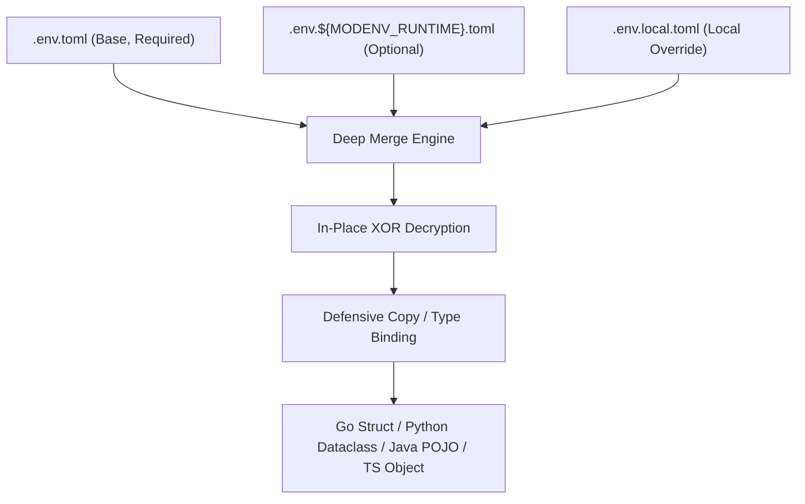

# modenv: Polyglot Configuration & Secret Loader

`modenv` provides hierarchical, cascading TOML configuration loading, in-place secret decryption, and environment state management across Go, Python, Java, and TypeScript.

All language implementations adhere to a unified set of architectural tenets, tested and built hermetically using Bazel.

## Documentation & Guides

### Core Concepts
- [Tenets of Configuration](): The 7 foundational rules of modenv.
- [Purpose & Methodology](): Why modenv exists, pain points solved, and core design principles.
- [Architecture & Dataflow](): Complete end-to-end dataflow pipeline, sequence diagrams, and subsystems.
- [Configuration Hierarchy & Merging](): Cascading precedence matrix, deep merge rules, and prefix path routing.
- [Universal CLI](): Cross-platform Go binary, commands reference, and multi-architecture release targets.

### Language Integration Guides
- [Go Integration](): Struct binding, library usage, and test fixtures.
- [Python Integration](): Dataclass mapping, uv setup, and typed access.
- [Java Integration](): POJO binding, Maven artifacts, and reflection mapping.
- [TypeScript Integration](): ESM interface mapping, pnpm packages, and zero-dependency runtime.
