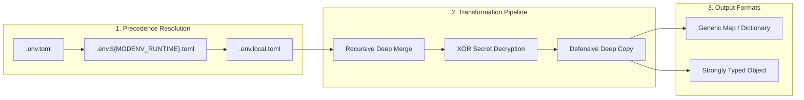

# Tenets of Configuration

`modenv` defines seven core tenets of configuration management implemented across all supported languages.

## 1. Hierarchical Cascading Configuration
Configuration is merged in deterministic order:
1. `.env.toml`: Base configuration. **Mandatory**. Missing base configuration raises a fatal file-not-found error.
2. `.env.${MODENV_RUNTIME}.toml`: Runtime environment overlay (e.g. `production`, `development`). **Optional**. Merged over base if present.
3. `.env.local.toml`: Local developer overrides. **Optional**. Always loaded last to enforce absolute precedence. Never committed to version control.

## 2. Prefix Path Routing
All file resolution occurs relative to the directory defined in the `MODENV_PREFIX` environment variable. If unset or empty, paths resolve relative to the current working directory.

## 3. Deep Merging
Nested dictionary structures are recursively merged. Child keys in higher-precedence files override matching child keys without deleting adjacent sibling keys in the same section.

## 4. Transparent Secret Encryption / Decryption
Values prefixed with `xor:` are decrypted in-place at load time:
- Cipher: Bitwise XOR against a repeated key.
- Format: `xor:<hex-encoded-bytes>`.
- Secret Key Resolution:
  1. Environment variable `MODENV_KEY`.
  2. Fallback key: `modenv-default-key`.

## 5. Defensive Copying & Strong Type Binding
Configuration loaders never return mutable references to internal parser state:
- When binding to structs, dataclasses, or classes, a deep clone is returned.
- Mutations to the returned instance do not pollute upstream configuration caches.

## 6. Environment Variable Lifecycle (`EnvManager`)
`EnvManager` tracks all environment modifications:
- `set(key, value)`: Records initial state upon first mutation.
- `get(key)`: Retrieves current value.
- `lookup(key)`: Returns presence status and value.
- `unset(key)`: Clears environment variable while preserving rollback capability.
- `restore()`: Reverts all modified keys to their exact initial state and clears tracking.

## 7. Unified Command-Line Interface
The project provides a single universal cross-platform CLI written in Go (`//cmd/cli`):
- `setup`: Scaffolds standard `.env.*.toml` template files.
- `read`: Merges, decrypts, and prints the resolved configuration tree as TOML.
- `encode <value>`: Encrypts a plaintext secret into an `xor:...` token.

---

## Detailed Concepts & Guides
- [Purpose & Methodology](): Architectural rationale and design principles.
- [Architecture & Dataflow](): Detailed sequence diagrams and subsystem internals.
- [Configuration Hierarchy & Merging](): Cascading precedence matrix and deep merge rules.
- [Smart Secrets & Secret Stores](): Multi-tiered secrets management, URI prefixes (`simple://`, `pks://`, `cloud://`), and GCP Secret Manager integration.
- [Universal CLI](): Command-line executable, commands reference, and multi-platform binary distributions.
