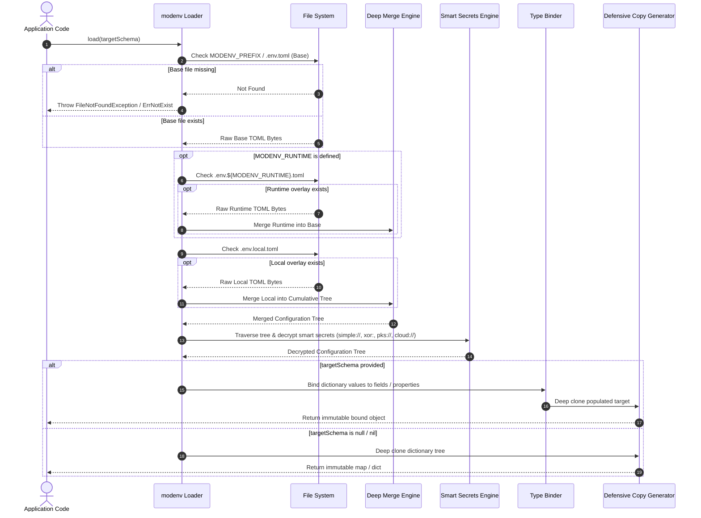
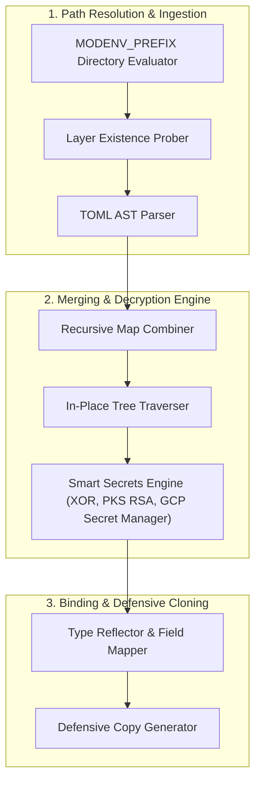

# Architecture & Dataflow

`modenv` executes an explicit, predictable pipeline that transforms physical TOML files on disk into typed, decrypted in-memory objects.

---

## 1. End-to-End Processing Pipeline

---

## 2. Core Subsystems

### 2.1 Path Resolver & Ingestion Subsystem
- **Prefix Path Routing**: All configuration file lookups are computed via `resolvePath(filename)`.
- If `MODENV_PREFIX` is set (e.g. `/etc/config/my-service`), all files (`.env.toml`, `.env.production.toml`, `.env.local.toml`) are resolved relative to that directory.
- If `MODENV_PREFIX` is empty or unset, paths resolve relative to the current process working directory (`.` or `process.cwd()`).

### 2.2 Deep Merge Engine
- Recursively traverses nested dictionary/table structures.
- Keys present in higher-precedence overlays overwrite existing keys in lower layers.
- Non-overlapping sibling keys are preserved in full.
- Arrays/lists are treated as atomic values (an overlay array completely replaces the base array rather than appending, preserving explicit configuration control).

### 2.3 Smart Secrets Decryption Engine
See [Smart Secrets & Secret Stores]() for full reference.
- **Prefix Dispatcher**: Identifies URI scheme:
  - `simple://<hex>`: Symmetric cyclic XOR encryption using `MODENV_KEY`.
  - `xor:<hex>`: Legacy backward-compatible symmetric XOR.
  - `pks://<base64>`: Asymmetric RSA PKCS#1 v1.5 encryption (2048-bit+). Decrypts using private key from `MODENV_PRIVATE_KEY`, `MODENV_KEY_LOCATION`, or `[secrets_store] key_location`.
  - `cloud://<secret>`: Resolves secret payloads directly from Google Cloud Secret Manager using OAuth2 credentials, with local override support via `MODENV_CLOUD_SECRET_<NAME>`.
- **In-Place Traversal**: In-memory decryption occurs before data is bound to typed objects.

### 2.4 Object Binder & Memory Isolator
- **Go**: Uses `reflect` and `BurntSushi/toml` unmarshaler to populate structs and primitive fields. Returns a deep clone.
- **Python**: Inspects `@dataclass` fields and `__dict__` attributes, recursing through nested dataclasses and dictionaries. Returns `copy.deepcopy(target)`.
- **Java**: Uses Java reflection to set declared fields, converting snake_case TOML keys to camelCase Java member variables. Returns `deepCloneObject(target)`.
- **TypeScript**: Recursively traverses and assigns object properties using `structuredClone` to ensure zero shared mutable references.

### 2.5 Lifecycle Manager (`EnvManager`)
- Implements a snapshot-and-rollback pattern for OS environment variables.
- Uses thread-safe data structures (`sync.Mutex` in Go, `ConcurrentHashMap` in Java, process maps in Python and TypeScript).
- Guarantees test isolation and safe transient environment overrides.

---

## 3. Language Implementation Matrix

| Architecture Layer | Go (`clients/go/`) | Python (`clients/python/`) | Java (`clients/java/`) | TypeScript (`clients/typescript/`) |
| :--- | :--- | :--- | :--- | :--- |
| **TOML Parser** | `github.com/BurntSushi/toml` | Standard `tomllib` (3.11+) | `org.tomlj:tomlj` | `smol-toml` |
| **TOML Serializer** | `toml.NewEncoder` | Standard / `tomli-w` | Native AST Formatter | `smol-toml.stringify` |
| **Type Reflection** | `reflect.ValueOf` | `dataclasses.fields` / `__dict__` | `Field.setAccessible(true)` | Object Property Traversal |
| **Defensive Copy** | Deep copy / unmarshal | `copy.deepcopy` | Reflection Cloner | Native `structuredClone` |
| **Thread Safety** | `sync.Mutex` | Global GIL / thread safety | `synchronized` / `ConcurrentHashMap` | Single-Thread Event Loop |
| **Library Target** | `//clients/go/pkg/modenv` | `//clients/python:modenv` | `//clients/java:modenv` | `//clients/typescript:modenv_sources` |
| **CLI Target** | `//cmd/cli` | `//cmd/cli` | `//cmd/cli` | `//cmd/cli` |

> [!NOTE]
> Following the DRY principle, a single hermetic cross-platform CLI is maintained in Go at `//cmd/cli` and compiled for all target architectures and platforms. Language-specific directories under `clients/` are pure embedding libraries.
