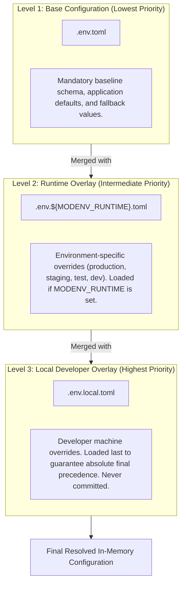
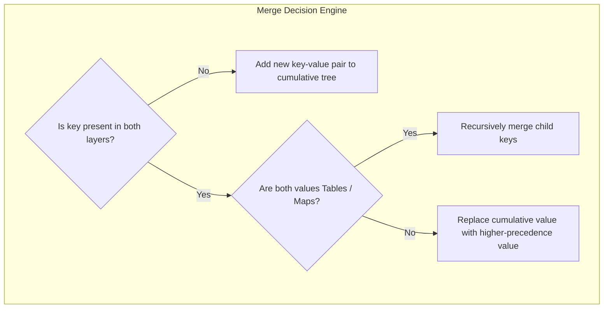
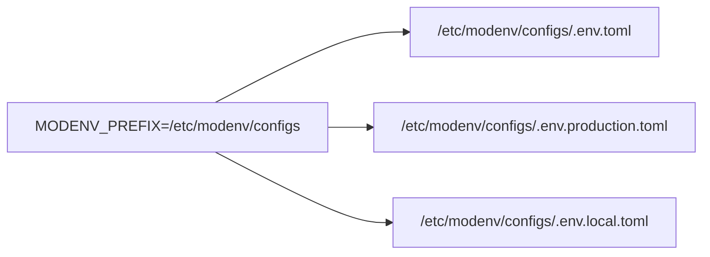

# Configuration Hierarchy & Merging

`modenv` establishes an unambiguous, deterministic cascading model. Multiple TOML files are evaluated in priority sequence, deep-merged into a unified configuration tree, and decrypted in memory.

---

## 1. Cascading Precedence



### Precedence Rules

| File | Requirement | Role | Commit to VCS? |
| :--- | :--- | :--- | :--- |
| **`.env.toml`** | **Required** | Base schema, default ports, timeouts, non-sensitive credentials | **Yes** |
| **`.env.${MODENV_RUNTIME}.toml`** | Optional | Stage-specific cluster hosts, logging levels, connection pools | **Yes** |
| **`.env.local.toml`** | Optional | Local port binding, debug switches, developer machine test tokens | **No (Git Ignored)** |

> [!IMPORTANT]
> **Base File Requirement**: If `.env.toml` is missing from the directory resolved by `MODENV_PREFIX`, `modenv.load()` will immediately abort with a descriptive `FileNotFound` error. Overlay files (`.env.${MODENV_RUNTIME}.toml` and `.env.local.toml`) are optional; if absent, they are silently skipped.

---

## 2. Deep Merge Semantics

When multiple layers contain overlapping keys, `modenv` applies deterministic deep-merge semantics:



### Merge Rule Reference
1. **Scalar Replacement**: Primitive values (strings, numbers, booleans) in higher-precedence files unconditionally overwrite values in lower-precedence files.
2. **Recursive Table Merging**: If both layers contain a table/map under the same key, child keys are recursively merged. Unmentioned sibling keys are retained untouched.
3. **Atomic Array Replacement**: Arrays/lists are treated as atomic units. If a higher layer specifies an array, it completely replaces the lower layer's array (no appending or interleaving).

---

## 3. Concrete Merge Walkthrough

Consider an enterprise service with three configuration layers:

### Layer 1: `.env.toml` (Base)
```toml
app_name = "order-service"
port = 8080
debug = false
tags = ["orders", "v1"]

[database]
host = "mysql.internal"
port = 3306
pool_size = 10
timeout_seconds = 30
password = "xor:01000704022949063a1600061f03421901" # Encrypted default password

[metrics]
enabled = false
endpoint = "/metrics"
```

### Layer 2: `.env.production.toml` (Overlay for `MODENV_RUNTIME=production`)
```toml
# Only override production-specific settings
port = 443

[database]
host = "prod-db-cluster.aws.internal"
pool_size = 50
# Notice: database.port, database.timeout_seconds, and database.password are NOT mentioned.
# They will be preserved from .env.toml!

[metrics]
enabled = true
```

### Layer 3: `.env.local.toml` (Developer Local Override)
```toml
# Local machine override to test locally against localhost
debug = true

[database]
host = "127.0.0.1"
password = "plain-local-dev-password"
```

### Final Resolved Configuration (`modenv read`)
```toml
app_name = "order-service"
port = 443                               # From .env.production.toml
debug = true                             # From .env.local.toml
tags = ["orders", "v1"]                  # From .env.toml

[database]
host = "127.0.0.1"                       # Overridden by .env.local.toml
port = 3306                              # Preserved from .env.toml
pool_size = 50                           # Overridden by .env.production.toml
timeout_seconds = 30                     # Preserved from .env.toml
password = "plain-local-dev-password"   # Overridden by .env.local.toml

[metrics]
enabled = true                           # Overridden by .env.production.toml
endpoint = "/metrics"                    # Preserved from .env.toml
```

---

## 4. Directory & Prefix Routing (`MODENV_PREFIX`)

By default, `modenv` resolves files in the current working directory:

```bash
# Looks for ./.env.toml, ./.env.production.toml, etc.
modenv read
```

In containerized or Kubernetes environments, configuration files are typically mounted as volumes (e.g. ConfigMaps or Secrets). To route `modenv` to an alternate location:

```bash
export MODENV_PREFIX="/etc/modenv/configs"
modenv read
```



All language implementations (`Go`, `Python`, `Java`, `TypeScript`) resolve paths using this exact mechanism before opening files.
