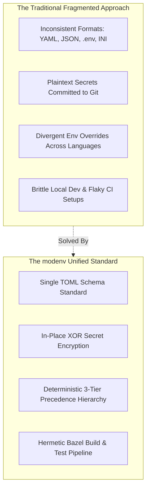

# Purpose & Methodology

## 1. The Configuration Dilemma in Polyglot Systems

Modern cloud enterprises rarely build on a single programming language. A production architecture often pairs a high-throughput **Go** API gateway, **Python** analytics and AI/ML services, a core **Java** transaction processing tier, and a **TypeScript** frontend or BFF (Backend-for-Frontend).

In these environments, traditional configuration approaches degrade rapidly:

### Key Pain Points Solved
- **Configuration Drift**: When different services parse configuration using different rules, subtle semantic discrepancies arise (e.g. how YAML interprets booleans or how environment variables clobber nested objects).
- **Leaked Credentials**: Storing production credentials in version control invites catastrophic credential leaks. `modenv` embeds encrypted secrets directly in TOML files using transparent symmetric XOR encryption.
- **Developer Overhead**: Local machine overrides should never accidentally be checked into Git. `modenv` reserves `.env.local.toml` exclusively for local overrides and enforces its exclusion in `.gitignore`.
- **State Pollution**: Mutating global environment variables during integration tests causes flaky, order-dependent test failures. `modenv` provides `EnvManager` to snapshot and rollback environment mutations cleanly.

---

## 2. Core Methodology

`modenv` is built on five operational principles:

### 2.1 Declarative TOML Standard
TOML (Tom's Obvious Minimal Language) was chosen as the universal configuration specification across all four languages:
- **Human Readable**: Clean syntax without the ambiguity or whitespace hazards of YAML.
- **Strict Typing**: Native support for strings, integers, floats, booleans, arrays, and datetime types.
- **Table-Oriented**: Logical separation into sections and subsections matching idiomatic structs, dataclasses, POJOs, and TypeScript interfaces.

### 2.2 Deterministic Cascading Hierarchy
Every configuration lookup follows an uncompromising three-tier cascading hierarchy:
1. **Base Configuration (`.env.toml`)**: The universal baseline schema and sensible defaults. This file is mandatory.
2. **Runtime Overlay (`.env.${MODENV_RUNTIME}.toml`)**: Environment-specific overrides (e.g. `staging`, `production`, `test`). Merged over the base configuration.
3. **Local Developer Overlay (`.env.local.toml`)**: Local developer overrides. Always loaded last, overriding everything. Strictly uncommitted.

### 2.3 In-Place Secret Decryption
Sensitive credentials (database passwords, API tokens, service keys) can be stored directly within TOML files prefixed with `xor:`:
- Tokens are encrypted via `modenv encode <secret>` or language-specific APIs.
- At runtime, `modenv` detects the `xor:` prefix and decrypts the value in-memory using `MODENV_KEY`.
- No plaintext passwords ever need to exist in checked-in configuration files.

### 2.4 Defensive Copying & Immutability
When `modenv.load()` binds configuration data into an application object or returns a map:
- The parser returns an **isolated deep clone**.
- Application modifications to the returned object never mutate the cached or underlying configuration state.
- Ensures thread safety and prevents accidental cross-component state tampering.

### 2.5 Reversible Environment Management
Through `EnvManager`, `modenv` abstracts environment variable mutations:
- Records the original value upon the first `set()` or `unset()`.
- Provides an atomic `restore()` operation to revert the process environment to its pristine initial state.
- Essential for testing suites, parameterized runs, and multi-tenant worker loops.
