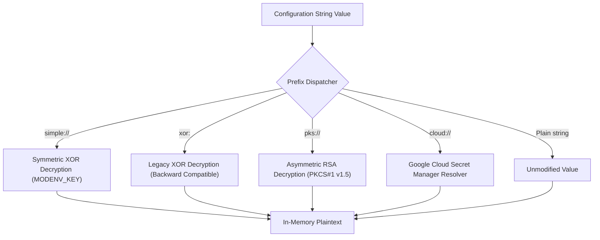

# Smart Secrets & Secret Stores

`modenv` provides native, multi-tiered secret management across all supported languages (Go, Python, Java, and TypeScript). Configuration files can declare sensitive values that are decrypted dynamically at runtime based on URI schemes, eliminating plaintext secrets from version-controlled files.

---

## 1. Secrets Store Configuration (`[secrets_store]`)

Every `modenv` configuration can declare a `[secrets_store]` table at the root level of `.env.toml` or any runtime overlay (such as `.env.production.toml`). This table establishes baseline settings for secret resolution:

```toml
[secrets_store]
type = "simple"                  # Default store type: "simple", "pks", or "cloud"
google_cloud_project = "my-gcp-project" # GCP Project ID for Secret Manager
google_cloud_region = "us-central1"     # GCP Region for regional resources
key_location = "keys/private.pem"       # Path to RSA private key (relative to MODENV_PREFIX or absolute)
```

### Configuration Fields

| Field | Type | Default | Description |
| :--- | :--- | :--- | :--- |
| `type` | string | `"simple"` | Default secret store type (`"simple"`, `"pks"`, or `"cloud"`). |
| `google_cloud_project` | string | `""` | Google Cloud Project ID used for `cloud://` Secret Manager lookups when not specified in the URI. Falls back to `GOOGLE_CLOUD_PROJECT` or `GCP_PROJECT` environment variables. |
| `google_cloud_region` | string | `""` | Google Cloud Region for regional secret management deployments. |
| `key_location` | string | `""` | File path to the RSA private key in PEM format (PKCS#8 or PKCS#1) used for `pks://` asymmetric decryption. Resolved relative to `MODENV_PREFIX` if a relative path is provided. |

---

## 2. URI Schemes & Smart Loading

When `modenv.load()` traverses the merged configuration tree, any string containing an recognized URI prefix is dynamically dispatched to its corresponding decryption loader:



### 2.1 Simple XOR Secrets (`simple://` and `xor:`)
Lightweight obfuscation suitable for non-critical developer environments and baseline masking:
- **URI Format**: `simple://<hex-encoded-ciphertext>` (standard) or `xor:<hex-encoded-ciphertext>` (legacy backward-compatible).
- **Algorithm**: Cyclic byte-wise XOR against `MODENV_KEY` (fallback: `modenv-default-key`).
- **Generation**:
  ```bash
  modenv encode --type=simple "my-password"
  # Output: simple://01000704...
  ```

### 2.2 Private Key Encrypted Secrets (`pks://`)
Enterprise-grade asymmetric encryption using RSA PKCS#1 v1.5:
- **URI Format**: `pks://<base64-encoded-ciphertext>`.
- **Algorithm**: RSA with PKCS#1 v1.5 padding and SHA-256 (supports 2048-bit, 3072-bit, and 4096-bit keys).
- **Public Encryption Key**: Anyone with the service's public key (`.pem`) can encrypt secrets (e.g. CI/CD pipelines, operations staff) without knowing the secret key or granting access to production environments.
- **Private Decryption Key Resolution**:
  1. `MODENV_PRIVATE_KEY`: Complete PEM string injected via environment variable or container secret mount.
  2. `MODENV_KEY_LOCATION`: Path to private key PEM file.
  3. `[secrets_store] key_location`: Path specified in `.env.toml` (resolved relative to `MODENV_PREFIX`).
- **Generation**:
  ```bash
  modenv encode --type=pks --public-key=keys/app_public.pem "super-secret-db-pass"
  # Output: pks://grKhOtE7TXQNSt3bht5iatVOf/...
  ```

### 2.3 Google Cloud Secrets (`cloud://`)
Centralized secret management backed by Google Cloud Secret Manager:
- **URI Formats**:
  - Short format: `cloud://<secret-name>` (uses `google_cloud_project` from `[secrets_store]` or environment). Resolves `latest` version.
  - Fully qualified resource format: `cloud://projects/<project>/secrets/<secret-name>/versions/<version>`.
- **Authentication & Resolution**:
  - Uses standard Google Cloud OAuth2 access tokens via `GOOGLE_OAUTH_ACCESS_TOKEN` or `GCP_ACCESS_TOKEN`.
  - Endpoint configurable via `MODENV_GCP_ENDPOINT` (defaults to `https://secretmanager.googleapis.com`).
- **Offline / Local Testing Overrides**:
  - Any cloud secret can be overridden locally in development or test suites using the `MODENV_CLOUD_SECRET_<NAME>` environment variable without needing active GCP credentials:
    ```bash
    export MODENV_CLOUD_SECRET_MY_DB_SECRET="local-test-password"
    ```
- **Custom Programmatic Resolver**:
  - Applications can inject custom resolver functions via `setCloudSecretResolver(...)` to integrate custom Secret Manager client SDKs or in-memory caches.

---

## 3. Polyglot Usage Examples

### Go
```go
package main

import (
    "fmt"
    "github.com/rrmcguinness/modenv/pkg/modenv"
)

type Config struct {
    SecretsStore modenv.SecretsStoreConfig `toml:"secrets_store"`
    Database     struct {
        SimplePass string `toml:"simple_password"` // decrypted from simple://...
        PksPass    string `toml:"pks_password"`    // decrypted from pks://...
        CloudPass  string `toml:"cloud_password"`  // resolved from cloud://...
    } `toml:"database"`
}

func main() {
    var cfg Config
    if _, err := modenv.Load(&cfg); err != nil {
        panic(err)
    }
    fmt.Printf("DB Password: %s\n", cfg.Database.PksPass)
}
```

### Python
```python
from modenv import load, SecretsStoreConfig

# Load resolved configuration dictionary or bind to typed instance
cfg = load()
print("Decrypted simple secret:", cfg["database"]["simple_password"])
print("Decrypted PKS secret:", cfg["database"]["pks_password"])
print("Resolved Cloud secret:", cfg["database"]["cloud_password"])
```

### Java
```java
import com.retailcortex.modenv.Modenv;
import java.util.Map;

public class Application {
    public static void main(String[] args) throws Exception {
        Map<String, Object> config = Modenv.load();
        Map<String, Object> db = (Map<String, Object>) config.get("database");
        
        System.out.println("Decrypted PKS: " + db.get("pks_password"));
        System.out.println("Resolved Cloud: " + db.get("cloud_password"));
    }
}
```

### TypeScript
```typescript
import { load } from "@retail-cortex/modenv";

interface AppConfig {
  database: {
    simple_password: string;
    pks_password: string;
    cloud_password: string;
  };
}

const config = load<AppConfig>();
console.log("Decrypted PKS:", config.database.pks_password);
console.log("Resolved Cloud:", config.database.cloud_password);
```

---

## 4. CLI Secret Tooling

The universal Go CLI provides subcommands and flags to generate and inspect smart secrets:

```bash
# Encrypt with simple XOR
modenv encode --type=simple "my-plaintext-secret"

# Encrypt with legacy xor: prefix
modenv encode --legacy "my-plaintext-secret"

# Encrypt with RSA public key
modenv encode --type=pks --public-key=path/to/public.pem "my-plaintext-secret"

# Inspect and verify resolved configuration including all decrypted secrets
modenv read
```
